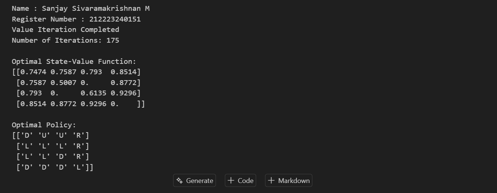

# Implementation-of-Value-Iteration-for-Optimal-Policy-Computation-using-Gymnasium

---
## Aim

To implement the **Value Iteration** algorithm for solving a finite Markov Decision Process using the Gymnasium `FrozenLake-v1` environment, and to compute the optimal state-value function and optimal policy using the Bellman optimality equation.

---

## Problem Statement
Implement the Value Iteration algorithm to determine the optimal policy for a 4×4 Medium FrozenLake environment. The objective is to compute the optimal state-value function and identify the best action to take from each state so that the agent reaches the goal while avoiding holes and maximizing the expected cumulative reward.


## Software Requirements
IDE: Jupyter Notebook / VS Code / Google Colab
Installation:
```
pip install gymnasium numpy matplotlib
```

## Environment Description
The experiment uses a 4×4 Medium FrozenLake environment. The agent starts at the Start (S) state and aims to reach the Goal (G) while avoiding Holes (H). The map contains two holes, making navigation moderately difficult. The environment is slippery, meaning the agent may move in an unintended direction due to stochastic transitions. The Value Iteration algorithm computes the optimal value function and derives the optimal policy for reaching the goal with the highest expected reward.
```
S F F F
F F H F
F H F F
F F F G
```
## MDP Representation

The **FrozenLake** environment is modeled as a **Markov Decision Process (MDP)**, which is represented by the tuple:

```text
(S, A, P, R, γ)
```

Where:

- **S (States):** The environment consists of **16 states** arranged in a **4×4 grid**.
- **A (Actions):** The agent can perform four possible actions:
  - **0** → Left
  - **1** → Down
  - **2** → Right
  - **3** → Up
- **P (Transition Probability):** Defines the probability of moving from one state to another after taking an action. Since the environment is **slippery**, the agent may move in an unintended direction, making the transitions stochastic.
- **R (Reward Function):**
  - **Goal State (G):** +1
  - **Frozen Tile (F):** 0
  - **Hole (H):** 0
- **γ (Discount Factor):** **0.99**, which determines the importance of future rewards compared to immediate rewards.

### Objective

The objective of the MDP is to determine an **optimal policy** that maximizes the **expected cumulative discounted reward**, enabling the agent to safely navigate from the **Start (S)** state to the **Goal (G)** while avoiding holes.

## Theory

**Value Iteration** is a dynamic programming algorithm used to solve **Markov Decision Processes (MDPs)**. It computes the optimal value function by iteratively updating the value of each state based on the maximum expected return over all possible actions. The process continues until the change in state values becomes smaller than a predefined threshold, indicating convergence.

Once the optimal value function is obtained, the **optimal policy** is derived by selecting the action with the highest expected value at each state.

### Bellman Optimality Equation

The Value Iteration algorithm is based on the **Bellman Optimality Equation**:

```math
V(s) = \max_{a} \sum_{s'} P(s' \mid s, a)
\left[ R(s, a, s') + \gamma V(s') \right]
```


## Algorithm

1. Initialize the value function V(s) = 0 for all states.
2. Set the discount factor γ and convergence threshold θ.
3. For each state:
        Compute the expected value for every possible action.
        Update the state value using the maximum action value.
4. Repeat the process until the maximum change in state values is less than θ.
5. After convergence, compute the optimal policy by selecting the action with the highest expected value for each state.
6. Display the optimal state-value function and optimal policy.


## Python Program

```python
# -------------------------------------------------
# Value Iteration Algorithm
# -------------------------------------------------

def value_iteration(env, gamma=0.99, theta=1e-8):
    """
    Performs value iteration and returns the optimal value function.
    """

    n_states = env.observation_space.n
    n_actions = env.action_space.n

    V = np.zeros(n_states)
    iteration = 0

    while True:
        delta = 0

        for s in range(n_states):

            action_values = np.zeros(n_actions)

            for a in range(n_actions):

                for prob, next_state, reward, done in env.unwrapped.P[s][a]:
                    action_values[a] += prob * (
                        reward + gamma * V[next_state] * (not done)
                    )

            best_value = np.max(action_values)

            delta = max(delta, abs(best_value - V[s]))
            V[s] = best_value

        iteration += 1

        if delta < theta:
            break

    # Extract Optimal Policy
    policy = np.zeros(n_states, dtype=int)

    for s in range(n_states):

        action_values = np.zeros(n_actions)

        for a in range(n_actions):
            for prob, next_state, reward, done in env.unwrapped.P[s][a]:
                action_values[a] += prob * (
                    reward + gamma * V[next_state] * (not done)
                )

        policy[s] = np.argmax(action_values)

    return V, policy, iteration

```

---

## Output



---

## Result

The Value Iteration algorithm was successfully implemented on the **4×4 Medium FrozenLake** environment. The algorithm iteratively updated the state-value function until convergence and generated the **optimal value function** along with the **optimal policy**. The resulting policy enables the agent to navigate from the **Start (S)** state to the **Goal (G)** while avoiding holes and maximizing the expected cumulative reward under stochastic (slippery) conditions.


## Inference

The experiment demonstrates that **Value Iteration** effectively solves a **Markov Decision Process (MDP)** by computing the optimal state values and deriving the corresponding optimal policy. The state values were observed to be higher for states closer to the goal and lower near holes, reflecting the expected future rewards. The algorithm converged after a finite number of iterations, confirming that Value Iteration is a reliable dynamic programming technique for determining optimal decision-making policies in uncertain environments.


